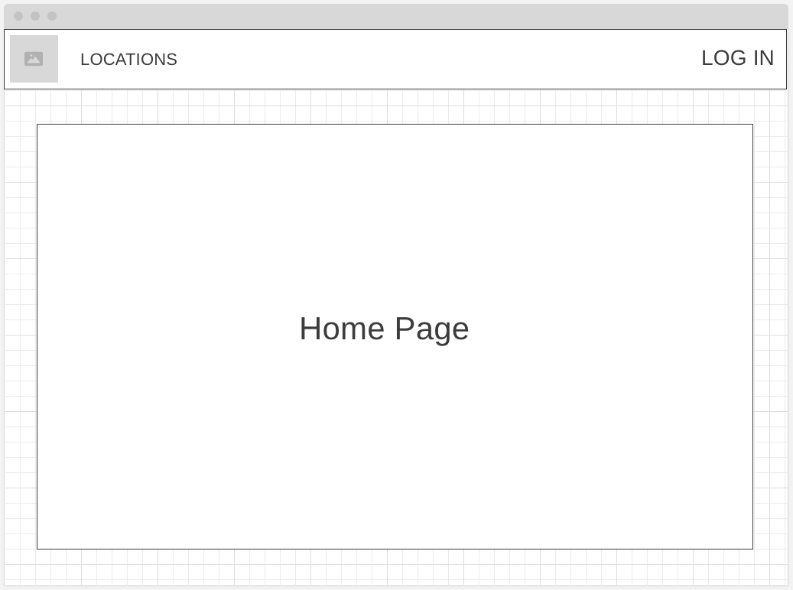
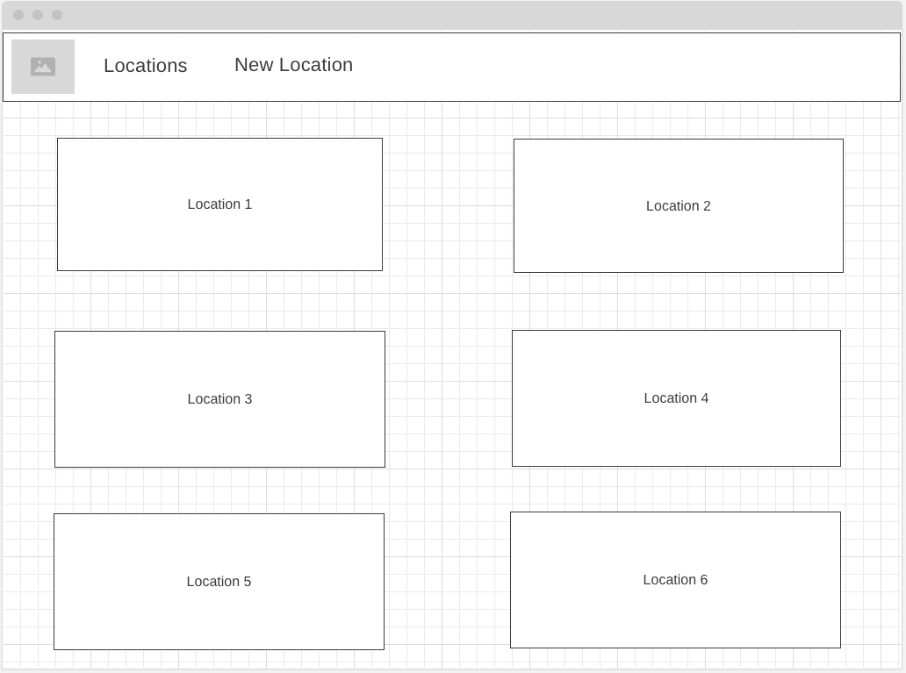
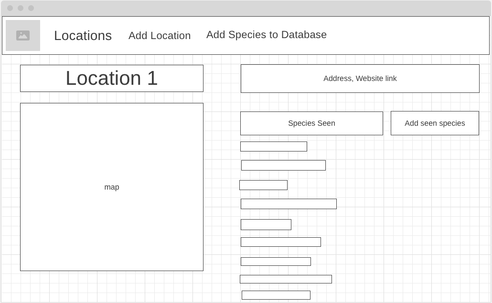
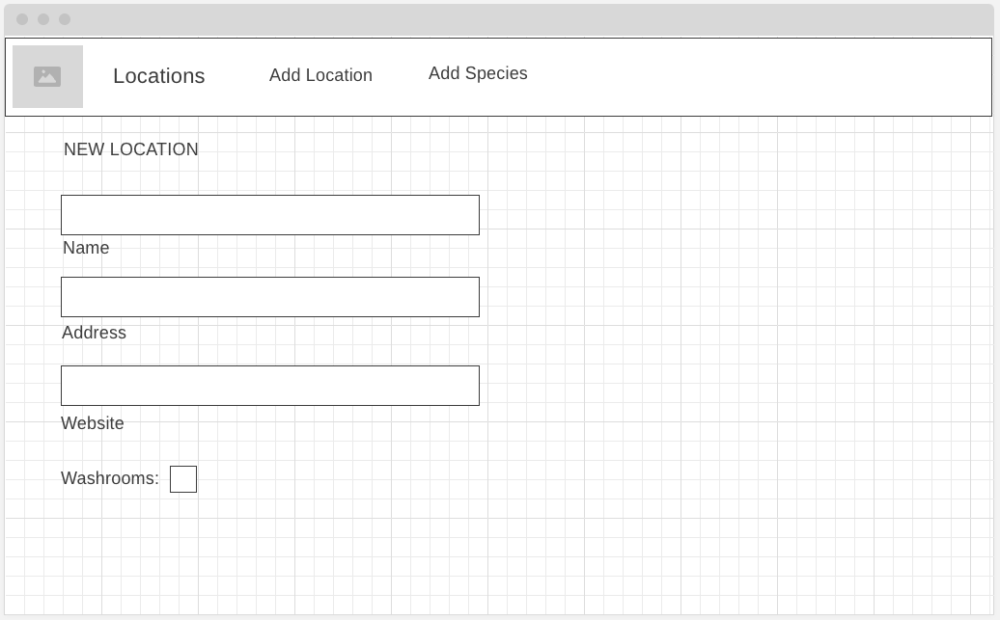
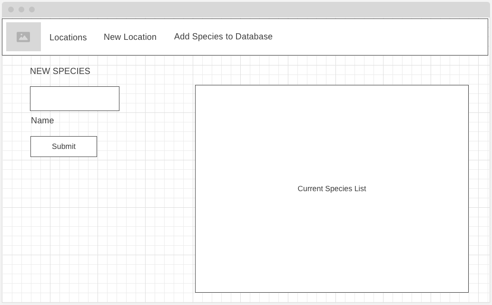

# Wildlife Locator
A full-stack web application that shows local wildlife areas, and what creatures have been seen there. Logged-in users are able to add locations, species, and sightings.
### Project Started: 2024/03/27
### By: Paul Burgess
#### [LinkedIn](https://www.linkedin.com/in/paul-burgess-a11154181/) 

***

### **Description**
This app has a database of different local parks and conservations areas. Viewers are able to see:
1. Where the parks and conservation areas are located
2. A link, if the location has a website
3. What wildlife has been seen there.

Once logged in, a user would also be able to:
1. Create entries for new areas
2. Create entries for new species
3. Post seen species to locations

---

### **Technologies Employed**

- HTML 
- CSS
    - Flexbox
    - Grid
- JavaScript
- Node
- Express
- OAuth
- APIs
    - Leaflet maps
    - Google Geocoder

---

### **Deployed App**

You can check out the app [here](https://claws-2fad79f86d48.herokuapp.com/) on Heroku. 

---

### **Screenshots**

##### Home Page

##### Locations Page

##### Location Details Page

##### New Location Page

##### New Species Page

---
### Trello Board

This project used a [Trello](https://trello.com/b/MDmvTwbi/wildlife-locator) board during development.

---
### **Future Updates**

- [ ] Add a species detail page; perhaps with a list of locations where it's been seen
- [ ] Sort sightings into categories

---

---